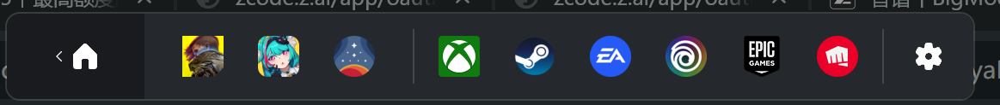
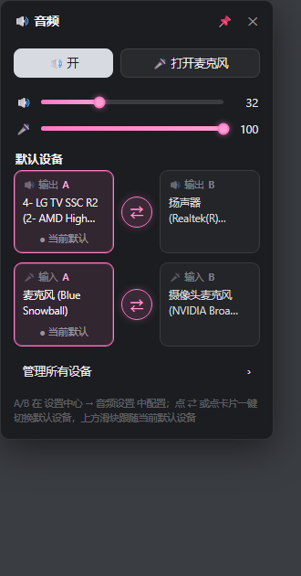

# EasyGamingBar

A slim, controller-first gaming overlay for Windows. Everything you reach for mid-game — FPS, HDR, audio output, a stream playing in the corner, a guide for the quest you are stuck on — in one bar you can drive entirely from the couch with an Xbox controller.

Think of it as an open, hackable take on the Xbox Game Bar: no store, no account, no telemetry, and a Rust core that talks directly to Windows (DXGI, ETW, WASAPI, D3D11) instead of shelling out to helper tools.

Built with [Tauri v2](https://tauri.app) + Rust + Vue 3. Windows 10/11 only.



## Features

**The bar**
- Frameless, always-on-top bar you summon with a hotkey or the Xbox button — and collapse when you do not want it
- Quick toggles on the left edge: HDR on/off (mirrors Win+Alt+B) and A/B audio output presets (headphones vs. speakers, one click)
- Detachable widgets: performance, audio, display, guide
- Clock, tray icon, autostart, first-run wizard, English / 简体中文 UI



**Game library**
- One-click import that finds installed games from Steam, Epic, GOG and Start Menu shortcuts (resolves `.lnk` targets, filters uninstallers and launchers), with cover art where available
- Launch games straight from the bar; playtime is tracked locally per game

**Performance HUD**
- FPS and 1% lows measured *inside* the game process (frame time at the Present hook — the same place RTSS gets it), so attribution is never wrong
- CPU, GPU, RAM and VRAM usage via PDH counters
- Push de-duplication and EMA smoothing so a 25 Hz HUD does not cost frames while you play

**In-game overlay for exclusive fullscreen (optional, off by default)**
- In true exclusive fullscreen no top-level window can draw — not even the Game Bar. EasyGamingBar can instead render the bar *into the game's own swap chain*: a hook DLL is injected into the detected foreground game and composites the bar onto the back buffer right before Present
- The same hook is what measures frame time, so the FPS number needs no driver and no external tool
- D3D11 games only; D3D12/Vulkan titles get frame counting but no overlay

**Controller-first everywhere**
- Every surface — bar, widgets, settings, dropdowns — is navigable with A/B/X/Y, the stick and the d-pad, with a visible focus ring
- While you drive the live window with the controller, the game keeps seeing a neutral pad (input synthesis through the hook), so your character does not spin
- Win11 long-press Xbox button task view can be tamed from settings

**Live companion**
- A built-in browser window pinned over the game for streams or videos: click-through lock mode hands focus back to the game, "pure mode" crops the page down to just the player
- Push-to-talk voice control: local [whisper.cpp](https://github.com/ggml-org/whisper.cpp) speech-to-text plus a rule-based parser drives the player (play/pause, volume, …). Speech never leaves your machine

**Guide assistant**
- One button: clean DXGI desktop-duplication screenshot (works in exclusive fullscreen, UI hidden) → a vision model reads which quest you are on → it opens a matching video walkthrough and jumps to the right episode (defaults to Bilibili)
- Bring your own OpenAI-compatible endpoint and key

**Quality-of-life**
- Quick actions drawer (hold-to-confirm shutdown and friends) and a gamepad-friendly virtual keyboard
- Global hotkeys, and a watchdog that detects a wedged WebView and reloads it before you notice

## Hotkeys

| Keys | Action |
| --- | --- |
| `Win+Shift+G` | Show / hide the bar |
| Xbox button | Show / hide the bar (strong focus) |
| `Ctrl+Alt+F` | Free the mouse pointer from the locked live window |
| `Win+Shift+K` | Virtual keyboard |
| `Win+Shift+L` | Lock / unlock the live window |
| `Win+Alt+B` | HDR toggle (system hotkey, mirrored by the bar) |

## Warning: anti-cheat and the in-game overlay

The in-game overlay and the FPS measurement both work by injecting a DLL into the game process. That is exactly the technique cheats use, so anti-cheat systems may flag it — leave the feature off for online games with kernel anti-cheat, and check the rules for anything competitive.

It is **off by default** and nothing else depends on it: the bar, library, widgets, live window, voice control and guide assistant all run without injection. Turning the toggle off stops drawing immediately; the injected DLL stays resident until the game exits (unloading a hooked DLL would crash the game) and does nothing from then on.

## Getting started

Requires Windows 10 (1809+) or 11, x64, and the WebView2 Runtime (preinstalled on Windows 11).

```
npm install
npx tauri dev
```

For a release build:

```
npx tauri build
```

### Building the hook DLL

The in-game overlay hook is a separate crate and is not built by the default flow:

```
cd src-tauri/hooks/egb_hook
cargo build --release
copy target\release\egb_hook.dll ..\resources\hooks\
```

Then build the app again — resources are bundled into the binary at build time.

## How the in-game overlay works

```
EasyGamingBar process                     Game process
─────────────────────                     ────────────
bar window ──PrintWindow──► BGRA bitmap
      │                                   egb_hook.dll
      ▼                                   (Present vtable hooked,
shared D3D11 texture ──handle via───────►  both blt and flip chains)
shared memory                               │
                                            ▼
                                        open shared texture,
                                        alpha-blend onto the back
                                        buffer before every Present
```

The host captures its own bar window with `PrintWindow(PW_RENDERFULLCONTENT)` (so it works even when the game covers everything), uploads it to a cross-process shared D3D11 texture, and passes the handle through a shared-memory block. The hook DLL picks it up, detects on the fly whether the bitmap carries premultiplied or straight alpha and picks the matching blend state, restores every piece of D3D11 pipeline state it touches, and never unloads once injected.

## Status

v0.1.0 — early alpha. The feature set is settling, but details are still moving.

## License

TBD
